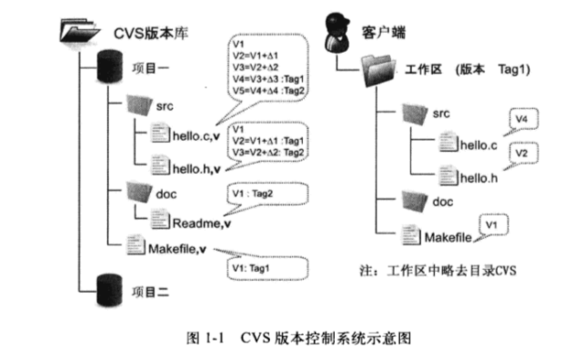
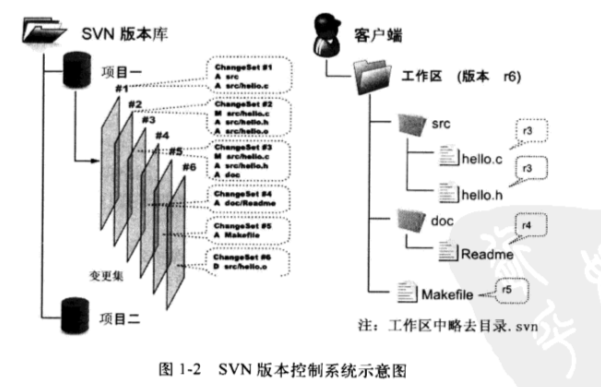

# 版本控制简介

版本控制系统（也称为源代码控制管理系统或修订控制系统）是保持文件多个版本的一种机制。当修改某文件后，你仍旧可以访问文件之前的任意一个修订版本。也是共同合作交付软件时所使用的一种机制。  

本质上版本控制系统的目的有两个：  
1. 保留每个文件的所有版本的历史信息，并使之易于查找。
2. 让分布式团队（无论是空间还是时间）可以愉快的写作。  

版本控制不仅仅针对源代码。每个与所开发的软件相关的产物都应被置于版本控制之下。  

# CVS
CVS（Concurrent Versions System）诞生于1985年，是由荷兰阿姆斯特丹 VU 大学的 Dick Grune 教授实现的。当时 Dick Grune 和两个学生共同开发一个项目，但是三个人的工作时间无法协调到一起，迫切需要一记录和协同开发的工具软件。于是 Dick Grune 通过脚本语言对 RCS（本地版本控制系统）进行封装，设计出有史以来地一个被大规模使用的版本控制工具。  

1986年通过新闻组发布了CVS，1989年 Brian Berliner 用C语言将CVS进行了重新。  

CVS 成功的为后来的版本控制系统确立了标准，像提交说明（commit log）、检入（checkin）、检出（checkout）、里程碑（tag）、分支（branch）等概念在CVS中就已确立。  

  

#SVN
Subversion，由于其命令行工具为 svn，因此通常被简称为SVN。SVN由CollabNet公司于2000年资助并开始开发，目的是创建一个更好用的版本控制系统以取代CVS。  
  

相对于 CVS，SVN 在本质上并没有突破，都属于集中式版本控制系统。即一个项目只有唯一的一个版本库与之对应，所有的项目成员都通过网络向服务器进行提交。  

2009 年年底，SVN 由 CollabNet 公司交由 Apache 社区管理，SVN 成为了 Apache 组织的一个子项目。  

#Git
Linux 之父 Linus 是坚定的 CVS 反对者，他也同样的反对 SVN。这就是为什么在 1991-2002 这十余年间，Linus 宁可以手工修补文件的方式维护代码，也迟迟不愿使用CVS的原因。  

2002 年，Linus 顶着开源社区精英们口诛笔伐的压力，选择了一个商业版本控制系统 BitKeeper 作为 Linux 内核的代码管理工具。 BitKeep 不同于 CVS 和 SVN 等集中式版本控制工具，而是一款分布式版本控制工具  

2005 年， Andrew Tridgell（Samba的作者）试图对 BitKeeper 进行反向工程，以开发一个能与 BitKeeper 交互的开源工具。 BitMover 商业公司同 Linux 内核开源社区的合作关系结束，他们收回了 Linux 内核社区免使用 BitKeeper 的权利。  

通常来说，当工具跟不上项目需求时，开发人员就会开发一个新的工具。

这就迫使 Linux 开源社区（特别是 Linux 的缔造者 Linus Torvalds）基于使用 BitKeeper 时的经验教训，开发出自己的版本系统。他们对新的系统定制了若干目标：  
* 速度
* 简单的设计
* 对非线性开发模式的强力支持（允许成千上万个并行开发的分支）
* 完全分布式
* 有能力高效管理类似 Linux 内核一样的超大规模项目（速度和数据量）

Git，被它的创造者（Linus）称作“从地域来的信息管理工具”。