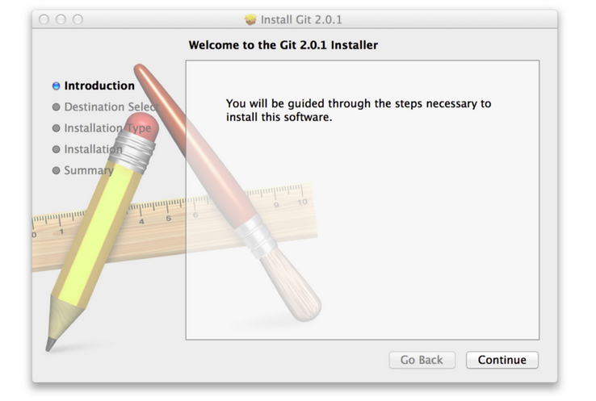

##安装 Git
在开始使用 Git 前，需要将它安装在你的计算机上。到 Git [官方网站](http://git-scm.com/downloads)查看最新版本。

##在 Linux 上安装
如果是在 Linux 上用二进制安装程序来安装 Git ，可以使用发行版包含的基础软件包管理工具来安装。以Debian/Ubuntu为例：  

    $sudo apt-get install git -y

##在 Mac 上安装 
Git 有多种方式。最简单的方法是安装 Xcode Command Line Tools。更高版本的系统中，在 Terminal 里尝试首次运行 git 命令即可。  

安装最新版本，可以使用二进制安装程序。在 Git 官方网站下载安装程序http://git-scm.com/download/mac  

你也可以将它作为 GitHub for Mac 的一部分来安装。图形化 Git 工具有一个安装命令行工具的选项。可以从 GitHub for Mac 网站上下载该工具，网址为https://desktop.github.com/ 

##在 Windows 上安装
官方版本可以在 Git [官方网站](http://git-scm.com/download/win)下载。  

另一个简单的方法是安装 GitHub for Windows。该安装程序包含图形化和命令行版本的 Git。可以在 [GitHub for Windows 网站](http://git-scm.com/download/win)上下载。  

##源代码安装

安装 Git 以来的库：curl、zlib、openssl、expat、还有libiconv。 

     $sudo yum install curl-devel expat-devel gettext-devel \
     openssl-devel zlib-devel
     $sudo apt-get install libcurl4-gnutls-dev libexpat1-dev gettext \
     libz-dev libssl-dev

添加文档格式（如 doc， html，info）：  

    $sudo yum install asciidoc xmlto docbook2x
    $sudo apt-get install asciidoc xmlto docbook2x

下载 tar 包，并安装  

    $wget https://github.com/git/git/archive/v2.7.2.tar.gz
    $tar -zxf v2.7.2.tar.gz
    $cd git-2.7.2
    $make configure
    $./configure --perfix=/usr
    $make all doc info
    $sudo make install install-doc install-html install-info
`注：推荐安装 GitHub 官方提供的 Git GUI 客户端安装包`

##Git 配置
Git 自带一个 git config 的工具来帮助设置控制 Git 外观和行为的配置变量。这些变量存储在三个不同的位置：
1. /etc/gitconfig 文件：包含系统上每一个用户及仓库的通用配置。如果使用带有 --system 选项的 git config 时，它会从此文件读写配置变量。
2. ~/.gitconfig 或 ~/.config/git/config 文件：只针对当前用户。可以传递 --global 选项让 Git 读写此文件。
3. 当前仓库的 Git 目录中的 config 文件(就是.git/config)：针对该仓库。

每一个级别覆盖上一级别的配置，所以 .git/config 的配置变量会覆盖 /etc/gitconfig 中的配置变量。

在 Windows 系统中，Git 会查找 $HOME 目录下（一般情况下是 C:\User\$USER）的 .gitconfig 文件。Git 同样也会寻找 /etc/gitconfig 文件，但只限于 MSys 的根目录下，即安装 Git 时所选的目标位置。

##用户信息
安装完 Git 首先就是设置你的用户名称与邮件地址。每一个 Git 的提交都会使用这些信息，并且会写入到你的每一次提交中，不可更改：  

    $git config --global user.name "Your name"
    $git config --global user.email yourmail@example.com

--global 选项，该命令只需要运行一次，之后无论在该系统上做任何操作， Git 都会使用那些信息。当针对特定项目使用不同的用户名称与邮件地址时，可以在那个项目目录下运行没有 --global 选项的命令来配置。  
很多 GUI 工具都会在第一次运行时帮组你配置这些信息。

##文本编辑器
默认 Git 会使用操作系统默认的文本编辑器，通常是 Vim。 如果想使用不同的文本编辑器，例如 Emacs，可以这样：

    $git config --global core.editor emacs

##检查配置信息
可以使用 git config --list 命令列出所有 Git 当时能找到的配置。

    $git config --list
    user.name=Your name
    uer.email=yourmail@example.com
    color.status=auto
    color.branch=auto
    color.interactive=auto
    color.diff=auto
    ……

通过 git config `<key>`:检查 Git 的某一项配置  

    $git config user.name
    Your name

##获取帮助
有三种方法可以查看 Git 命令的使用手册：

    $git help <verb>
    $git <verb> --help
    $man git-<verb>

例如查看 config 命令的收车  

    $git help config