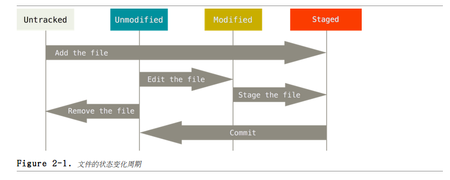

# Git 基础

##获取 Git 仓库
###在现有目录初始化存储库  
进入需要被追踪的项目目录并执行：

    $git init
初始化存储仓库会建立名为 `.git`的子目录，该目录包一个 Git 存储库架构所必要的所有文档。此时项目内任何额文档都还没有被追踪。  

对现有的文档开始做版本控制（除了空的目录以外），应该追踪这些文档并做第一次提交。可使用 git add 命令指定要追踪的文档，并提交。  

    $git add *.c
    $git add README
    $git commit -m 'initial project version'

##复制现有的版本库
Git 拉取的是服务器端所有资料的复本，项目历史中所有文档的所有版本都在执行 `git clone` 后拉回到本地。  

    $git clone https://github.com/morro-wind/gitshare.git mygit
会在当前路径下建立名为 `mygit` 的目录，在并其下初始化名为 `.git` 的目录。拉取版本库的所有文件，并拉取最新版本为工作复本。  

#提交更新到仓库
工作目录下的每个文件不外乎两正状态：  
已跟踪：指那些被纳入了版本控制的文件，上一次快照有其记录，现在状态可能处于未修改、已修改或已放入暂存区。  
未跟踪：除已跟踪文件以外都属未跟踪文件。  

编辑过某些文件后，由于自上次提交后对它们做了修改，Git 将它们标记为已修改文件。将这些修改的文件放入暂存区，然后提交所有暂存了的修改，如此反复。所以 Git 文件的生命周期如下：  

  

##查看文件当前状态  
使用 `git status` 命令可以查看文件处于什么状态。  

    $ git status
    On branch master
    nothing to commit, working directory clean
 
 Working directory clean 说明目前的工作目录没有未被跟踪或已被修改的文件。如有未被跟踪文档，Git 会将它们列出。同显示目前在哪一个分支（branch）。  
 
 新增文档到工作区后，再执行`git status`命令，会看到未被跟踪的档案  
 
    $touch README
    $git status
    On branch master
    Untracked files:
      (use "git add <file>..." to include in what will be committed)

            README

    nothing added to commit but untracked files present (use "git add" to track)

Untracked files 下发显示的就是未被跟踪的文件。除非明确指定要将文件加入提交的快照，Git 不会主动将它加入。

##跟踪新文件
使用 `git add` 命令，跟踪新增文件

    $git add README