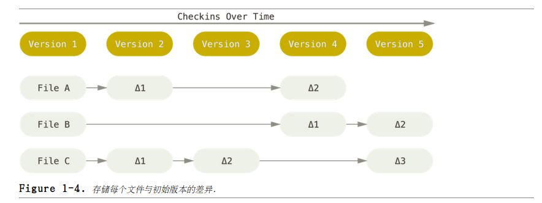
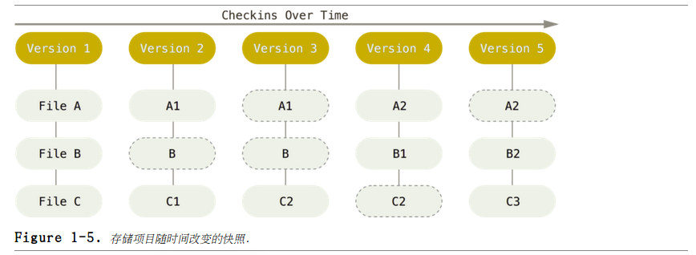
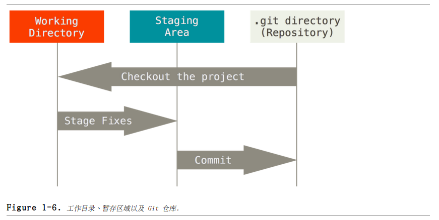

# Git 简介
那么，简单地说，Git 究竟是怎样的额一个系统呢？若理解了 Git 的思想和基本工作原理，用起来就会之其所以然，游刃有余。Git 在保存和对待各种信息的时候与其它版本控制系统有很大差异，尽管操作起来的命令形式非常接近，理解这些差异将有助于防止你使用中的困惑。

##直接记录快照，而非差异比较
Git 和其它版本控制系统（包括 Subversion和近似工具）的主要差别在于 Git 对待数据的方法。概念上来区分，其它大部分系统以文件变更列表的方式存储信息。这类系统（CVS、Subversion 等等）将它们保存的信息看作是一组基本文件和每个文件随时间逐步累积的差异。  
  

Git 不按照以上方式对待或保存数。反之，Git 更像是把数据看作是对小型文件系统的一组快照。每次你提交更新，或在 Git 中保存项目状态时，它主要对当时的全部文件制作一个快照并保存这个快照的索引。为了高效，如果文件没有修改，Git 不再重新存储该文件，而是只保留一个链接指向之前存储的文件。 Git 对待数据更像是一个 **快照流**。  

这是 Git 与几乎所有其它版本控制系统的重要区别。 Git 更像是一个小型的文件系统，提供了许多以此为基础构建的超强工具。

##近乎所有操作都是本地执行
在 Git 中的绝大多数操作都只需要访问本地文件和资源，一般不需要来自网络上其它计算机的信息。因为你在本地磁盘上就有项目的完整历史，所以大部分操作看起来瞬间完成。  

##Git 保证完整性
Git 中所有数据在存储前都计算校验和，然后以校验和来引用。这个功能建构在 Git 底，是构成 Git 哲学不可或缺的部分。若你在传送过程中丢失信息或损坏文件，Git就能发现。

Git用以计算校验和的机制叫做 SHA-1 散列（hash，哈希）。 Git 数据库中保存的信息都是以文件内容的哈希值来索引，而不是文件名。

##Git 一般只添加数据
你执行的 Git 操作，几乎只往 Git 数据库中增加数据。很难让 Git 执行任何不可逆操作。未提交更新时有可能丢失或弄乱修改的内容；但一旦你提交快照到 Git 中，就难以再丢失数据，特别是如果你定期的推送数据库到其它仓库。

##三种状态
Git 有三种状态，你的文件可能处于其中之一：
* 已提交（committed）：表示数据已经安全的保存在本地数据库中；
* 已修改（modified）：表示修改了文件，但还没保存到数据库中；
* 已暂存（staged）：表示对一个已修改文件的当前版本做了标记，使之包含在下次提交的快照中。  

由此引入 Git 项目的三个工作区域的概念：  
* Git仓库:仓库目录 Git 用来保持项目的元数据和对象数据库的地方。这是 Git 中最重要的部分，从其它计算机克隆仓库时，拷贝的就是这里的数据。
* 工作目录：对项目的某个版本独立提取出来的内容。放在磁盘上供你使用或修改。
* 暂存区域（索引）：是一个文件，保存了下次将提交的文件列表信息，一般在 Git 仓库目录中。

  

Git 基本工作流程：
1. 在工作目录中修改文件。
2. 暂存文件，将文件的快照放入暂存区域。
3. 提交更新，找到暂存区域的文件，将快照永久性存储到 Git 仓库目录。